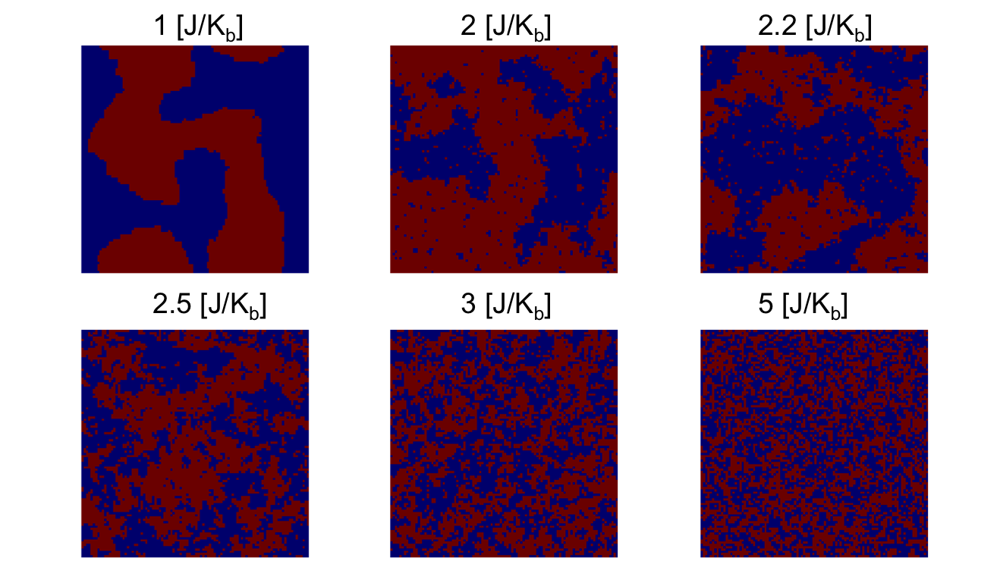

# Ising Model

Python code to simulate the Ising model of a Ferromagnet.

For a discussion of the theory, visit [my blog post](http://www.bdhammel.com/ising-model/).

The initial conditions of the ising lattice can be specified by the `tempature`, `initial state`, and `size parameters` of the model.

Running the simulation will output a video of system as it changes through out the run steps.

## Example

The `--help` command can show to possible parameters for modifying the simulation 

~~~bash
$ python ising.py --help
Usage: ising.py [OPTIONS]

Options:
  -t, --temperature FLOAT    temperature of the system  [default: 0.5]
  -i, --initial-state [r|u]  (R)andom or (U)niform initial state of the system [default: r]
  -s, --size INTEGER         Number of sites, M, in the MxM lattice  [default: 100]
  -e, --epochs INTEGER       Number of iterations to run the simulation for [default: 1000000]
  --video                    Record a video of the simulation progression
  --help                     Show this message and exit.
~~~

For example:

~~~bash
$ python ising.py --temperature .8 --initial-state r --video
~~~

## FAQ

If you get the error:

~~~bash
MovieWriter stderr:
dyld: Library not loaded: /usr/local/opt/x264/lib/libx264.152.dylib
  Referenced from: /usr/local/bin/ffmpeg
  Reason: image not found
~~~

Then you need to install ffmpeg 

~~~bash
$ brew install ffmpeg
~~~
